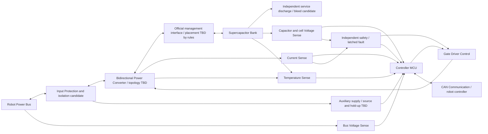

# System architecture

Concept / Assumption。最終topology、定格、pin、保護回路はTBD。

概念power pathはBus ⇄ Input Protection ⇄ Bidirectional Converter ⇄ Bank。
図中の公式管理moduleは採用位置のplaceholderで、最新版接続図確認まで製造用接続図にしない。
Bank側・bus側で故障energy供給源が異なる。input protectionだけでbank短絡を止められるとは限らない。

## Mode definitions

全mode共通: 硬故障はFへ。PWM OFFはbody diode導通やMOSFET shortを遮断しない。
隔離とbleedは機能要件であり未実装。表中activeは将来の意図。

| Mode | Power flow | Active components | Allowed transition and guard | Prohibited transition |
|---|---|---|---|---|
| A Startup / safe | 意図的energy transferなし。残留energyは未知として扱う | aux、reset supervisor、sense、inhibit。PWM OFF | B: self-test合格・polarity正常・limits承認。G: shutdown要求。F: fault | C/Eへ直接、reset後の自動再arm |
| B Precharge | 選んだport間のΔVをcurrent-limited pathで解消 | precharge candidate、sense、timer。main path/PWMはまだ許可しない | D: ΔVと時間/current基準合格、main接続確認。F: timeout/異常。G: 中止 | bypass直結、未完了でC/E |
| C Charging | bus → bank、bus power budgetとcell限界内 | converter、sense、balancing候補、independent trip、CAN | D: current ramp→zero確認。F/G | Eへ直接、cell OV時継続 |
| D Standby | 意図的transfer zero。balancing/bleed leakageは別計測 | sense、CAN、fault path。PWMは原則OFF | C/E: fresh許可・self-test・限界内。B: 再接続要。G/F | stale CAN commandによる再開 |
| E Discharging / assist | bank → robot、regen/source限界を守る | converter、sense、fault path、CAN | D: current ramp→zero確認。F/G | Cへ直接、UV/thermal/CAN loss時継続 |
| F Fault | controlled transfer停止。短絡時は隔離/energy制限、放電はfault内容で判断 | independent latch、isolation候補、ログ。bleedは安全確認時のみ | G: fault原因評価後の放電手順。A: 原因除去・明示reset・再self-test | C/Eへの直接復帰、通信復帰だけの再arm、無条件bleed ON |
| G Shutdown | robotとのtransfer停止、隔離後bank→放電path(安全なら) | discharge/service path、voltage確認。aux消失時もservice可能な手段 | H: approved voltage/energy/timeと再上昇確認を満たす。F: 放電不能。A: 明示再起動 | Hへの時間だけの遷移、main path自動再接続 |
| H Stored-energy-safe | 意図的供給なし、全cell/隔離部分含めsafeを確認 | measured indication、lockout。bleed継続は方式次第 | A: service終了・点検・明示起動 | C/E直行、表示LED消灯だけでsafe判定 |

CAN loss → F/inhibitを保守的方針とする。robotのbase bus供給を失わせるかは接続構成で別途評価し、assist停止とrobot主電源遮断を同一視しない。
充放電方向の変更はDを経由しzero current確認する。閾値・debounce・latencyはTBD。
input loss時はcapacitorからauxへ逆給電する可能性を検討し、意図せぬ再起動を拒否する。
