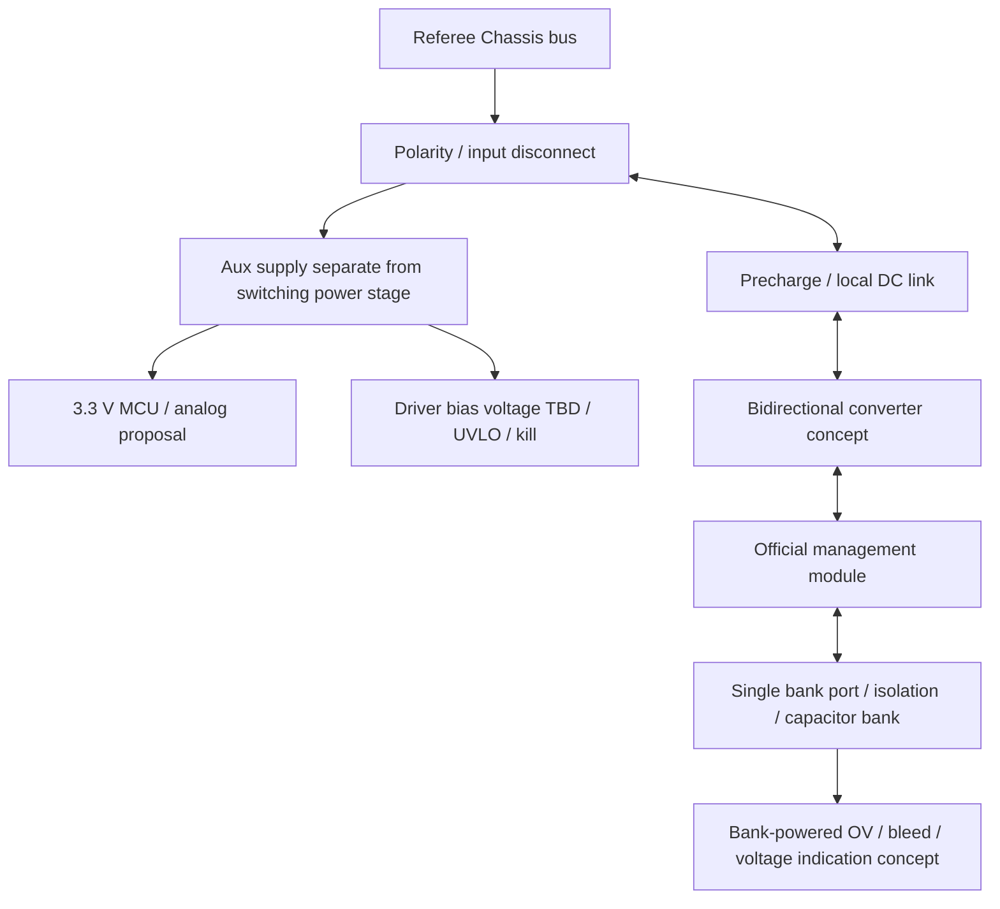

# Prototype Rev A — 2026-10-04 delegated decisions

ユーザーの委任に基づき、セル監視RAM設定・exact passive選定・外部ベンチ遮断アセンブリ・保護/熱/放電検証基準を[現行選定書](rev_a_design_freeze.md)へ確定した。選定はPrototype Assumption、実測検証は未実施。平均cap電流の初期上限9.5 A、OC約12 A、目標遮断0.5 µs、各link bulk6×470 µF、precharge timeout3 s。12 A/120 Wは後続の検証目標として保持。PCB placement/通電は開始しない。以下の2026-10-03以前の未選定表示は経緯記録であり、この選定書が優先する。

# Prototype Rev A — current status

2026-10-03 JST。**Current: Prototype Rev A schematic only.** Task2 architectureはユーザー採用承認済み。実機条件未確認は[Prototype envelope](../docs/prototype_rev_a_envelope.md)に明示した **ASSUMPTION — MUST VERIFY ON PROTOTYPE** として隔離し、詳細electrical schematicを作成した。部品/保護閾値はprototype候補で性能保証ではない。[現行review](../docs/rev_a_schematic_review.md)と[pinout](../docs/pinout.md)が現在の設計記録。PCB placement/routing、firmware、通電、120W使用許可、競技適合、Task4開始は未承認。以下の旧status/approval pending/skeleton-only記述はhistorical recordであり現在statusではない。

## Rev A current power domains

Robot BUS_FUSED → LM5164 12V gate bias; separately → LM5164 3.3V MCU/analog/logic/CAN. Aux is upstream of bus isolation and cannot be intentionally powered from bank. External bus-derived ACTUATOR_12V is required for external NO contacts; supply/coil load not implemented or approved. Bank powers BQ REG1/REG18 and independent residual LED/bleed. Local bus/cap links each470µF behind precharge/bypass. Service connections are external assembly boundaries, not permission for extra competition power ports.

## Historical records (preserved)

# Task 2 power tree

Auxのpower/current/hold-upはTBD。Chassis系はgimbal/Ammo等から給電しない(S145)。bank由来powerでreferee断電を回避しない。shutdown logging hold-upはgate killを継続する範囲のみ。bank monitorの接続/tapはS189適合レビューを要す。
3.3 VはMCU domain提案、driver railはpart決定後。OFFでもbankとlinkにenergyあり。aux lossでtransfer enable OFF、permanent bleed/independent indication/service dischargeはMCU不要の経路を要求。

---

## Task 1 record (historical; Task 2 above takes precedence)

# Power tree and energy boundary

| Domain | Source / sink | Safety requirement | TBD |
|---|---|---|---|
| Robot bus | robot source / chassis load / regen | sourceへの逆流とreferee計測点のpower制御 | bus envelope、regen吸収、公式module wiring |
| Converter | bus ⇄ capacitor | OC、OV、UV、deadtime、hardware inhibit | topology・ratings・response |
| Bank | stored energy | cell OV/UV、balance、bank側fault isolation | series/parallel、C、ESR、energy |
| Auxiliary | busまたはbank候補 | brownoutでgate OFF、起動順序、backfeed防止 | source、rails、hold-up、budget |
| Gate supply | aux候補 | UVLO、過電圧、float enable OFF | driver/rails/isolated supply |
| Bleed / service | bank → heat | MCU/robot bus消失でも安全化手段 | threshold、time、resistor energy |

充電時 P_bus はbank増加分と全損失を含む。放電時低bank電圧ほどbank currentが増えやすい。
bus current、bank current、inductor peak currentは同じではない。公式moduleの接口current条件をbus側に機械的に代入しない。
PWM OFF、input disconnect、aux OFFのいずれも単独ではstored-energy-safeを意味しない。
