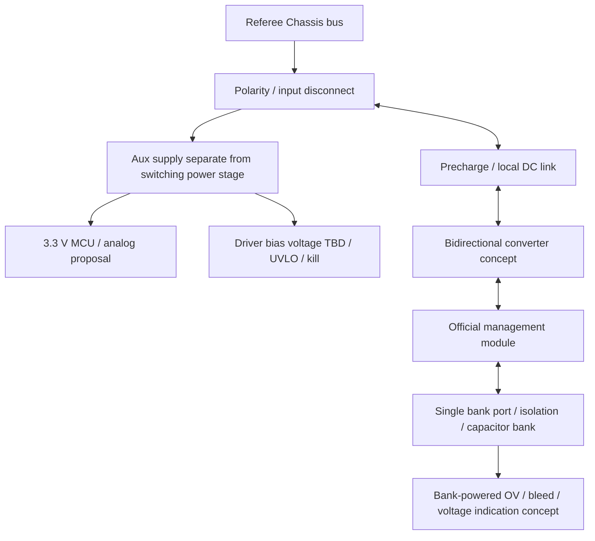

# Task 2 power tree

Auxのpower/current/hold-upはTBD。Chassis系はgimbal/Ammo等から給電しない(S145)。bank由来powerでreferee断電を回避しない。shutdown logging hold-upはgate killを継続する範囲のみ。bank monitorの接続/tapはS189適合レビューを要す。
3.3 VはMCU domain提案、driver railはpart決定後。OFFでもbankとlinkにenergyあり。aux lossでtransfer enable OFF、permanent bleed/independent indication/service dischargeはMCU不要の経路を要求。

---

## Task 1 record (historical; Task 2 above takes precedence)

# Power tree and energy boundary

| Domain | Source / sink | Safety requirement | TBD |
|---|---|---|---|
| Robot bus | robot source / chassis load / regen | sourceへの逆流とreferee計測点のpower制御 | bus envelope、regen吸収、公式module wiring |
| Converter | bus ⇄ capacitor | OC、OV、UV、deadtime、hardware inhibit | topology・ratings・response |
| Bank | stored energy | cell OV/UV、balance、bank側fault isolation | series/parallel、C、ESR、energy |
| Auxiliary | busまたはbank候補 | brownoutでgate OFF、起動順序、backfeed防止 | source、rails、hold-up、budget |
| Gate supply | aux候補 | UVLO、過電圧、float enable OFF | driver/rails/isolated supply |
| Bleed / service | bank → heat | MCU/robot bus消失でも安全化手段 | threshold、time、resistor energy |

充電時 P_bus はbank増加分と全損失を含む。放電時低bank電圧ほどbank currentが増えやすい。
bus current、bank current、inductor peak currentは同じではない。公式moduleの接口current条件をbus側に機械的に代入しない。
PWM OFF、input disconnect、aux OFFのいずれも単独ではstored-energy-safeを意味しない。
