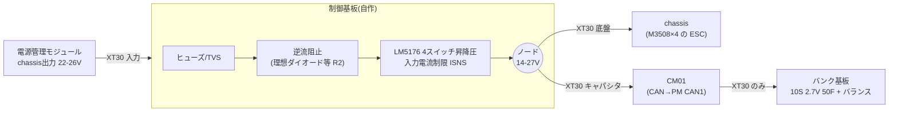

# Rev B ブロック図(案Y版: 充電専用+バンク直結給電)

状態: 設計メモ(2026-10-10)。案X版の `control_board_blocks.md` は保留(案X採用時のみ使う)。
前提は `requirements_and_architecture.md` 6.5節、部品の仮選定は `plan_y_charger_sizing.md`。

## 1. 構成(2枚+CM01)



- 底盤端子とキャパシタ端子は同一ノード(ユーザー確認)。バンクの電力はCM01経由(S184: 15 A以内)。
- バンク基板の電力インターフェースはXT30 1本のみ(S189)。センス線・通信線は出さない。

## 2. 制御・計測

```mermaid
flowchart TB
  subgraph MCU["STM32G431(遅い外側ループ)"]
    ADC["ADC: ノードV / 入力V / 入力I / ノードI"]
    ENCTL["GPIO: LM5176 EN / 逆流阻止"]
    PWMCL["PWM→RC: 入力電流制限オフセット"]
    UART["USART: 審判システム(0x0201/0x0202)"]
    CANRB["FDCAN: ロボット内CAN(任意)"]
  end
  NODE(("ノード")) --> ADC
  IN(("入力")) --> ADC
  OVCMP["ハード比較器<br/>入力OV / ノードOV / 過温"] -->|EN遮断(ラッチ)| CHG["LM5176"]
  PWMCL --> CHG
  ENCTL --> CHG
  PGOOD["PGOOD"] --> MCU
  CHG -. 保護はMCUに依存しない .- OVCMP
```

- MCUの役割: 入力電力制限(審判の上限と緩衝エネルギーに合わせてISNSの制限値を調整)、状態監視、ログ。CM01とは通信しない。
- 保護はハードで完結(EN既定オフ、OV/OT遮断)。MCUが止まってもバンクが入力へ逆流しない構成にする。
- 入力電力制限: ISNSは50 mV固定のため、PWM→RCで外部オフセットを注入する案(未確認・要試作)。

## 3. 保護の一覧
| 事象 | 対策 | 状態 |
|---|---|---|
| R2 バンク→入力の逆流(停止中のボディダイオード) | 入力側の逆流阻止 | 方式未決 |
| R3 回生でノード電圧が目標超過 → 入力コンデンサ電圧上昇 | 入力OV比較器でEN遮断、TVS、(別IC検討) | 未決。回生時の実測が必要 |
| 突入(空のバンク) | LM5176のソフトスタート+ISNS | プリバイアス/0 V起動は未確認 |
| 過電流 | LM5176のサイクル毎制限、ヒューズ | ヒカップ有無は未決 |
| ノード過電圧(>27 V) | ノードOV比較器でEN遮断 | 閾値は部品選定時 |
| 過温 | NTC+比較器 | 未選定 |
| 起動時 | EN既定オフ。MCUが確認後にオン | 方針 |

## 4. 補助電源(未決)
- MCU 3.3 Vは、入力(PM)またはノードの高い方から小型降圧で作る案。ノードは14〜27 Vで変動、入力は22〜26 V。
- LM5176のVCCは内蔵(7.35 V)。出力>8.5 VならBIAS=VOUT。

## 5. バンク基板
- 10S 2.7 V 50 F(27 V 5 F、1822 J)。単セルの容量公差で実測が2000〜2200 Jに近づくため、セル選定時に注意。
- セルバランス: 受動(抵抗)または並列クランプ(例: 各セル2.7 V付近)。基板内で完結させる(S189)。方式は未決。
- 過熱監視は基板内で完結できる範囲のみ(制御基板へ線を出さない)。
- ヒューズとXT30を同一基板に実装。JLCPCB SMT対象外の円筒セルは手はんだ/ボルト固定が必要になる可能性(要検討)。

## 6. 実測メモ
- 14 V未満で止まる原因はモータドライバと推定(ユーザー、2026-10-10)。ノード電圧の下限をESCの低電圧保護に合わせて設計する。ESCの具体的な閾値は未確認。
- 走行中chassis電力 約60 W。ピーク電流、回生時のノード電圧は未測定。

## 7. 次のステップ
1. R2/R3の方式決定(逆流阻止、OV遮断)。
2. 回生時ノード電圧とピーク電流の実測依頼。
3. バンク基板のセルバランス方式と機械構成(セル固定)。
4. 制御基板のKiCad回路図(電力段→計測→MCU)。
