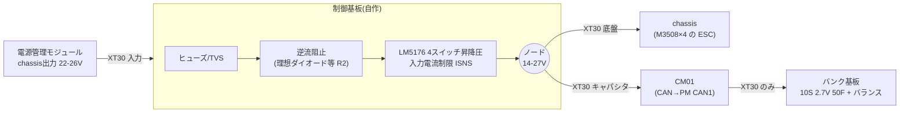

# Rev B ブロック図(案Y版: 充電専用+バンク直結給電)

状態: 設計メモ(2026-10-10)。案X版の `control_board_blocks.md` は保留(案X採用時のみ使う)。
前提は `requirements_and_architecture.md` 6.5節、部品の仮選定は `plan_y_charger_sizing.md`。

## 1. 構成(2枚+CM01)



- 底盤端子とキャパシタ端子は同一ノード(ユーザー確認)。バンクの電力はCM01経由(S184: 15 A以内)。
- バンク基板の電力インターフェースはXT30 1本のみ(S189)。センス線・通信線は出さない。

## 2. 制御・計測

```mermaid
flowchart TB
  subgraph MCU["STM32G431(遅い外側ループ)"]
    ADC["ADC: ノードV / 入力V / 入力I / ノードI"]
    ENCTL["GPIO: LM5176 EN / 逆流阻止"]
    PWMCL["PWM→RC: 入力電流制限オフセット"]
    UART["USART: 審判システム(0x0201/0x0202)"]
    CANRB["FDCAN: ロボット内CAN(任意)"]
  end
  NODE(("ノード")) --> ADC
  IN(("入力")) --> ADC
  OVCMP["ハード比較器<br/>入力OV / ノードOV / 過温"] -->|EN遮断(ラッチ)| CHG["LM5176"]
  PWMCL --> CHG
  ENCTL --> CHG
  PGOOD["PGOOD"] --> MCU
  CHG -. 保護はMCUに依存しない .- OVCMP
```

- MCUの役割: 入力電力制限(審判の上限と緩衝エネルギーに合わせてISNSの制限値を調整)、状態監視、ログ。CM01とは通信しない。
- 保護はハードで完結(EN既定オフ、OV/OT遮断)。MCUが止まってもバンクが入力へ逆流しない構成にする。
- 入力電力制限: ISNSは50 mV固定のため、PWM→RCで外部オフセットを注入する案(未確認・要試作)。

## 3. 保護の一覧
| 事象 | 対策 | 状態 |
|---|---|---|
| R2 バンク→入力の逆流(停止中のボディダイオード) | 入力直列のPMOS(ボディダイオードが逆流を阻止、ゲートは既定オフ) | **方式決定(7節)** |
| R3 回生でノード電圧が目標超過 → 入力コンデンサ電圧上昇 | PMOSオフ+コンバータ入力OV比較器でEN遮断+TVS | **方式決定(7節)**。回生時の実測は必要 |
| 突入(空のバンク) | LM5176のソフトスタート+ISNS | プリバイアス/0 V起動は未確認 |
| 過電流 | LM5176のサイクル毎制限、ヒューズ | ヒカップ有無は未決 |
| ノード過電圧(>27 V) | ノードOV比較器でEN遮断 | 閾値は部品選定時 |
| 過温 | NTC+比較器 | 未選定 |
| 起動時 | EN既定オフ。MCUが確認後にオン | 方針 |

## 4. 補助電源(未決)
- MCU 3.3 Vは、入力(PM)またはノードの高い方から小型降圧で作る案。ノードは14〜27 Vで変動、入力は22〜26 V。
- LM5176のVCCは内蔵(7.35 V)。出力>8.5 VならBIAS=VOUT。

## 5. バンク基板
- 10S 2.7 V 50 F(27 V 5 F、1822 J)。単セルの容量公差で実測が2000〜2200 Jに近づくため、セル選定時に注意。
- セルバランス: 受動(抵抗)または並列クランプ(例: 各セル2.7 V付近)。基板内で完結させる(S189)。方式は未決。
- 過熱監視は基板内で完結できる範囲のみ(制御基板へ線を出さない)。
- ヒューズとXT30を同一基板に実装。JLCPCB SMT対象外の円筒セルは手はんだ/ボルト固定が必要になる可能性(要検討)。

## 6. 実測メモ
- 14 V未満で止まる原因はモータドライバ(C620)と推定(ユーザー)。C620の低電圧保護閾値は10〜11 Vとユーザーは認識(**未確認**: Scribdの取扱説明書は外部取得不可)。10〜11 Vと14 Vが一致しないため、現行基板側の下限カットの可能性もある。設計ではノード下限を12 V以上として扱う(要確認)。
- 走行中chassis電力 約60 W。ピーク電流、回生時のノード電圧は未測定。

## 7. 次のステップ
1. R2/R3の方式決定(逆流阻止、OV遮断)。
2. 回生時ノード電圧とピーク電流の実測依頼。
3. バンク基板のセルバランス方式と機械構成(セル固定)。
4. 制御基板のKiCad回路図(電力段→計測→MCU)。

## 7. R2/R3/セルバランスの方式決定(2026-10-10、ユーザーから一任)
参考にできたもの: RM2025 Plus(DonotFreeze/RM-PCB-SuperCapControlBoard_Plus、STM32G431、半ブリッジ双方向)は、入力に**防逆流PMOS(AGM60P100A)**を置き、ハード/ソフトのタイミングで「PWM前にオン、PWM後にオフ」とし、バス入力にTVSを置く。PSP_supercapacitor(STM32G474、4スイッチ)は、ゲートドライバが起動時に焼損しやすかった(UCC27201。LM5106で安定)と記載。**均衡回路の参考資料(oshwhub/CSDNのTL431解説)は取得できず未確認**(ロボット対策/サーバーエラー。回避せず)。

### 7.1 R2/R3: 入力直列PMOS+OV遮断
- 入力(PM側)とLM5176入力の間に、P-ch MOSFETを直列に入れる。ドレイン=入力側、ソース=コンバータ側(ボディダイオードが入力→コンバータを導通、逆方向を阻止)。ゲートは既定オフ(プルアップ)。
- オン条件: 入力が19 V超かつ過電圧なし。オンの間は双方向導通になるため、コンバータ停止時・過電圧時は必ずオフにする(Plusと同じ考え方)。
- R3(回生で逆電流): コンバータ入力側にOV比較器(約29 V)を置き、超過でLM5176をEN遮断+PMOSオフ。入力にTVS(約33〜36 V級、Plusも同様にTVSを使用)。
- 利点: 部品が少なく安い。LM74700系の理想ダイオードは自動阻止だが、オン抵抗制御と逆電流時の挙動が別に必要になるため見送り。
- 要確認: PMOSのVds耐圧(≥40 V)、Vgs制限(ツェナー等)、オン抵抗(4.5 A時の損失)、遮断時のコンバータ入力コンデンサへの影響の実機確認。
- 残り: バンク満充電時の回生は、バンクが吸収できなくなりノード電圧が上がる。ESC側の過電圧限界は未確認(これはTaobao基板でも同じ課題)。

### 7.2 セルバランス: 並列クランプ(セル毎)+充電電流のテーパ
計算(算術): 定電流充電では、直列セルの電圧は容量に反比例して配分される。容量ばらつき±10%なら、平均2.62 V/セルでも最大約2.88 Vになりうる(定格2.7 V)。抵抗のみのバランスは、数十分〜時間オーダーの定常的な均衡で、急速充電中の過電圧を止められない。
- 採用案: 各セルに**シャント基準(TL431類)+バイパス素子による並列クランプ**(約2.65〜2.70 V)。クランプ電流は数百mA級で足りる(コンバータをCV動作させ、満充電付近で電流を絞るため)。出力設定は26.2 V(2.62 V/セル平均)。
- セルは容量マッチングされた組を使う(購入時にロット/容量測定を確認)。
- 基板内で完結(S189)。待機電流はクランプ基準の分圧抵抗で決まる(数百µA/セル以下に設計)。
- 代替(簡素): 抵抗のみ。部品は少ないが、容量ばらつきが大きいと2.7 Vを超える恐れ。
- 要確認: 参考回路の実測、クランプ素子の発熱、JLCPCB在庫(TL431類)。

## 8. 使用可能エネルギーの更新
C620の閾値が10〜11 Vなら、ノード27 V→11 Vで 1−(11/27)² ≈ 83 %(約1510 J)。14 V下限なら73 %(約1330 J)。
