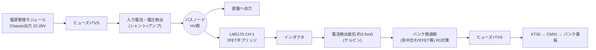
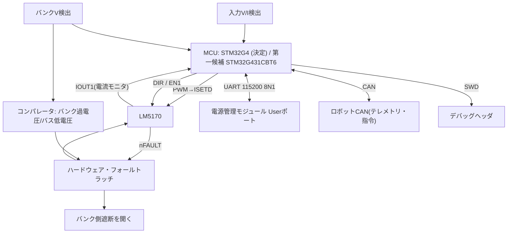

> 案Y採用により、このファイルは案X用(保留)。案Y版は `blocks_plan_y.md` を参照。

# Rev B 制御基板(功率控制板) ブロック図案

2026-10-10 ドラフト。**設計案であり、動作・安全・規則適合を保証しない。** 数値は[要件書](requirements_and_architecture.md)の前提(バンク10〜20 V、バス22〜26 V、バンク側平均13 A以下)に基づく。

## 1. 電力経路

- バスノードは「電源管理モジュールからの入力」「底盤への出力」「LM5170の高圧側」が接続される点。底盤の負荷電流はここを通る。
- **未決: 底盤の最大電流**(M3508×4の実運用ピーク)。これでコネクタ・ヒューズ・銅箔・FETが決まる。
- バンク側の電流(= CM01を通る電流、S184)は、LM5170の電流検出抵抗で制御・制限する。
- S7(Chassis接続の容量合計 ≤ 10 mF)に対して、バスノードのバルクコンデンサ容量を数える。解釈は未確認。

## 2. 制御・計測

## 3. MCUの役割(B案)

- 電流指令(ISETD用PWM)と方向(DIR)、有効化(EN)の設定。**200 kHz級の高速処理はしない。**
- 外側ループ(数百Hz〜数kHz): 入力側の実消費電力(V×I)を計測し、裁判システムが送る底盤電力上限(0x0201、GPT調査・未確認)に収まるよう、バンクの充放電電流を決める。
- 状態: OFF → 待機 → 充電 / アシスト → 故障。故障時はENを落とし、遮断を開く。
- 通信: 裁判システムUART受信(115200 8N1)、ロボットCANへのテレメトリ。CM01とは通信しない(仕様非公開)。
- **ファームウェアだけに保護を依存しない。** 下記のハードウェア保護を並列に置く。

## 4. ハードウェア保護(案)

| 保護 | 手段 | 状態 |
|---|---|---|
| 過電流(サイクルごと) | LM5170のIPK | データシート上の機能。閾値は設計 |
| バンク過電圧 | LM5170のOVPB(昇圧時は無効)+コンパレータ | 昇圧時の別手段が必要 |
| バス低電圧/逆流(R1) | バスがバンクを下回ったらバンク側遮断を開く | 未設計 |
| 電源起動 | EN・遮断はデフォルトOFF(MCUリセット・電源喪失時) | 未設計 |
| 起動時FET短絡検出 | LM5170内蔵 | データシート上の機能 |
| 過熱 | NTC → コンパレータ → ラッチ | 未設計 |
| ヒューズ | バンク側15 A級、入力側は底盤最大電流で決定 | 未選定 |

## 5. 補助電源

- LM5170のVCC: 9〜12 V(バスから降圧して生成)。
- MCU用3.3 V。
- バス低下時も、故障ラッチと遮断が動作し続けるか(電源喪失時にデフォルトOFFに倒れるか)を設計で確認する。

## 6. 未決事項

1. 底盤の最大電流と、入出力コネクタ(XT60等)・ヒューズの選定。**未測定(2026-10-10 ユーザー確認)。** 測定計画は6.2参照。
2. ~~MCUの機種~~ → **STM32G4系に決定(2026-10-10)**。第一候補はSTM32G431CBT6(LQFP-48)。下記6.1参照。
3. バンク側遮断の方式(背中合わせNch FET+ドライバ、理想ダイオードコントローラなど)と、閉成時の突入電流の扱い。
4. 1chで運用するか、2chインターリーブにするか(2chは小型インダクタ・低リップルだがFETが4個)。
5. 入力側の電流検出方式(シャント+アンプ、または電力モニタIC)。
6. S7の解釈と、バスノードのバルク容量の上限。
7. LM5170の在庫(9個)リスク。車載品(Q1)の使用可否。

## 6.1 MCU候補(JLCPCB部品ライブラリ、2026-10-10 Chromeで確認。在庫・価格は変動)

| 型番 | 品番 | 種別 | パッケージ | 在庫 | 1個の価格 |
|---|---|---|---|---|---|
| STM32G431CBT6 | C529355 | Extended | LQFP-48 | 521 | 約$4.84(リードタイム8日表示) |
| STM32G431RBT6 | C431633 | Extended | LQFP-64 | 519 | $5.75 |
| STM32G431CBU6 | C529356 | Extended | UFQFPN-48 | 3230 | $7.93 |
| STM32G474CBT6 | C730123 | Extended | LQFP-48 | 617 | $4.29 |

- 必要な周辺機能(ADC数点、PWM1点、FDCAN、UART、GPIO)は、G431で足りる見込み(データシートの原本確認は未実施)。
- G474CBT6は同じLQFP-48でほぼ同価格。Rev Aのファームの流用を重視するなら代替候補。ピン互換性は未確認。
- 全てExtended部品。

## 6.2 底盤の最大電流: 暫定の考え方と測定計画

- 参考値(私は未確認): DJI C620電調の電流はM3508で定格10 A・ピーク20 A程度とされる。4個の理論最大は80 Aだが、実運用のバス電流はこれよりかなり小さいと思われる。
- 暫定: 実測まで確定しない。コネクタ・ヒューズ・銅箔・FETは、測定後に決める。
- 測定案(どちらか): (a) 現行のロボットの底盤給電線に、直流クランプメータや電流プローブを当てて、走行・衝突・旋回の最大値を記録する。(b) 現行のTaobao製スパキャ基板などに電流表示があれば、それを記録する。

## 7. 次のステップ

1. 上記1〜3を決める。
2. LM5170の外付け部品(FET、インダクタ、電流検出抵抗、ブートストラップ、デッドタイム)を、算術で仮選定する。
3. KiCad回路図(ブロックごと)の作成に進む。
